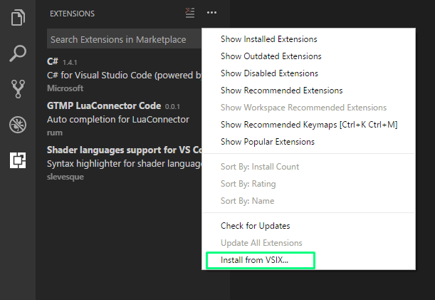

Auto completion packages
=============================

To help you with scripting there is two available packages for auto completion.

=====================
Sublime Text 3
=====================

Download package from `here <https://github.com/romgerman/LuaConnector-Documentation/packages>`_

-------------
Installation
-------------

1. Copy the package to `yourSublimeTextInstallationFolder/Packages`
2. Reload Sublime Text

=====================
Visual Studio Code
=====================

Download package from `here <https://github.com/romgerman/LuaConnector-Documentation/packages>`_

-------------
Installation
-------------

1. Open VS Code
2. Install it through "Extensions" tab

